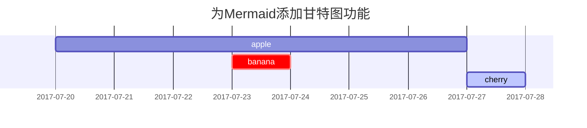

## 标题

<!-- markdownlint-capture -->
<!-- markdownlint-disable -->
# H1 — 标题
{: .mt-4 .mb-0 }

## H2 — 标题
{: data-toc-skip='' .mt-4 .mb-0 }

### H3 — 标题
{: data-toc-skip='' .mt-4 .mb-0 }

#### H4 — 标题
{: data-toc-skip='' .mt-4 }
<!-- markdownlint-restore -->

## 段落

Quisque egestas convallis ipsum, ut sollicitudin risus tincidunt a. Maecenas interdum malesuada egestas. Duis consectetur porta risus, sit amet vulputate urna facilisis ac. Phasellus semper dui non purus ultrices sodales. Aliquam ante lorem, ornare a feugiat ac, finibus nec mauris. Vivamus ut tristique nisi. Sed vel leo vulputate, efficitur risus non, posuere mi. Nullam tincidunt bibendum rutrum. Proin commodo ornare sapien. Vivamus interdum diam sed sapien blandit, sit amet aliquam risus mattis. Nullam arcu turpis, mollis quis laoreet at, placerat id nibh. Suspendisse venenatis eros eros.

## YAML Front Matter

```yaml
---
title: 文本与排版
description: 文本、排版、数学公式、图表、流程图、图片、视频等示例。
date: 2019-08-08 11:33:00 +0800
categories: [博客, 演示]
tags: [排版]
pin: true
math: true
mermaid: true
image:
  path: /assets/img/img-test.jpg
  lqip: data:image/webp;base64,UklGRpoAAABXRUJQVlA4WAoAAAAQAAAADwAABwAAQUxQSDIAAAARL0AmbZurmr57yyIiqE8oiG0bejIYEQTgqiDA9vqnsUSI6H+oAERp2HZ65qP/VIAWAFZQOCBCAAAA8AEAnQEqEAAIAAVAfCWkAALp8sF8rgRgAP7o9FDvMCkMde9PK7euH5M1m6VWoDXf2FkP3BqV0ZYbO6NA/VFIAAAA 
  alt: Chirpy主题在多种设备上的响应式渲染。
---
```

## 列表

### 有序列表

1. 首先
2. 其次
3. 最后

### 无序列表

- 章节
  - 小节
    - 段落

### 待办列表

- [ ] 工作
  - [x] 步骤1
  - [x] 步骤2
  - [ ] 步骤3

### 描述列表

太阳
: 地球环绕的恒星

月亮
: 地球的天然卫星，通过太阳光反射可见

## 块引用

> 这是一段_块引用_的示例。

## 提示

<!-- markdownlint-capture -->
<!-- markdownlint-disable -->
> 一个显示为`提示`类型的示例。
{: .prompt-tip }

> 一个显示为`信息`类型的示例。
{: .prompt-info }

> 一个显示为`警告`类型的示例。
{: .prompt-warning }

> 一个显示为`危险`类型的示例。
{: .prompt-danger }
<!-- markdownlint-restore -->

## 表格

| 公司                         | 联系人           |   国家 |
| :--------------------------- | :--------------- | -----: |
| Alfreds Futterkiste          | Maria Anders     |   德国 |
| Island Trading               | Helen Bennett    |   英国 |
| Magazzini Alimentari Riuniti | Giovanni Rovelli | 意大利 |

## 链接

<http://127.0.0.1:4000>

## 脚注

点击链接将定位到脚注[^footnote]，这是另一个脚注[^fn-nth-2]。

## 行内代码

这是一个`行内代码`示例。

## 文件路径

这里是 `/path/to/the/file.extend`{: .filepath}。

## 代码块

### 常规

```text
这是一个没有语法高亮和行号的通用代码片段。
```

### 指定语言

```bash
if [ $? -ne 0 ]; then
  echo "命令未成功执行。";
  #执行必要操作/退出
fi;
```

### 指定文件名

```sass
@import
  "colors/light-typography",
  "colors/dark-typography";
```

{: file='_sass/jekyll-theme-chirpy.scss'}

## 数学公式

通过 [**MathJax**](https://www.mathjax.org/) 支持数学公式：

$$
\begin{equation}
  \sum_{n=1}^\infty 1/n^2 = \frac{\pi^2}{6}
  \label{eq:series}
\end{equation}
$$

我们可以引用公式 \eqref{eq:series}。

当 $a \ne 0$ 时，二次方程 $ax^2 + bx + c = 0$ 的解为：

$$ x = {-b \pm \sqrt{b^2-4ac} \over 2a} $$

## Mermaid SVG



## 图片

### 默认（带标题）

{: width="972" height="589" }
_全屏宽度并居中_

### 左对齐

{: width="972" height="589" .w-75 .normal}

### 浮动到左侧

{: width="972" height="589" .w-50 .left}
Praesent maximus aliquam sapien. Sed vel neque in dolor pulvinar auctor. Maecenas pharetra, sem sit amet interdum posuere, tellus lacus eleifend magna, ac lobortis felis ipsum id sapien. Proin ornare rutrum metus, ac convallis diam volutpat sit amet. Phasellus volutpat, elit sit amet tincidunt mollis, felis mi scelerisque mauris, ut facilisis leo magna accumsan sapien. In rutrum vehicula nisl eget tempor. Nullam maximus ullamcorper libero non maximus. Integer ultricies velit id convallis varius. Praesent eu nisl eu urna finibus ultrices id nec ex. Mauris ac mattis quam. Fusce aliquam est nec sapien bibendum, vitae malesuada ligula condimentum.

### 浮动到右侧

{: width="972" height="589" .w-50 .right}
Praesent maximus aliquam sapien. Sed vel neque in dolor pulvinar auctor. Maecenas pharetra, sem sit amet interdum posuere, tellus lacus eleifend magna, ac lobortis felis ipsum id sapien. Proin ornare rutrum metus, ac convallis diam volutpat sit amet. Phasellus volutpat, elit sit amet tincidunt mollis, felis mi scelerisque mauris, ut facilisis leo magna accumsan sapien. In rutrum vehicula nisl eget tempor. Nullam maximus ullamcorper libero non maximus. Integer ultricies velit id convallis varius. Praesent eu nisl eu urna finibus ultrices id nec ex. Mauris ac mattis quam. Fusce aliquam est nec sapien bibendum, vitae malesuada ligula condimentum.

### 深色/浅色模式及阴影

下图会根据主题偏好切换深色/浅色模式，且带有阴影效果。

{: .light .w-75 .shadow .rounded-10 w='1212' h='668' }
{: .dark .w-75 .shadow .rounded-10 w='1212' h='668' }

## 视频



## 反向脚注

[^footnote]: 脚注来源
[^fn-nth-2]: 第二个脚注来源
